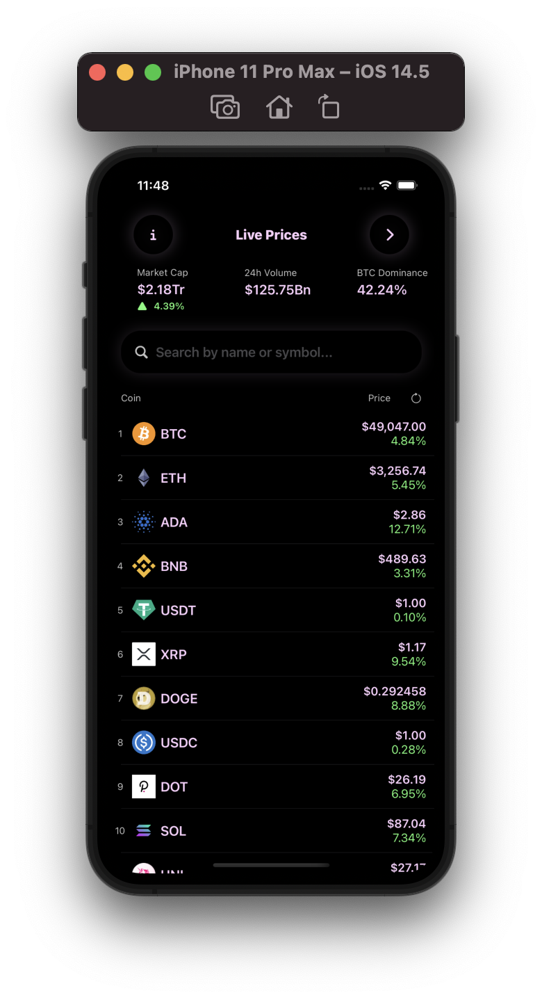
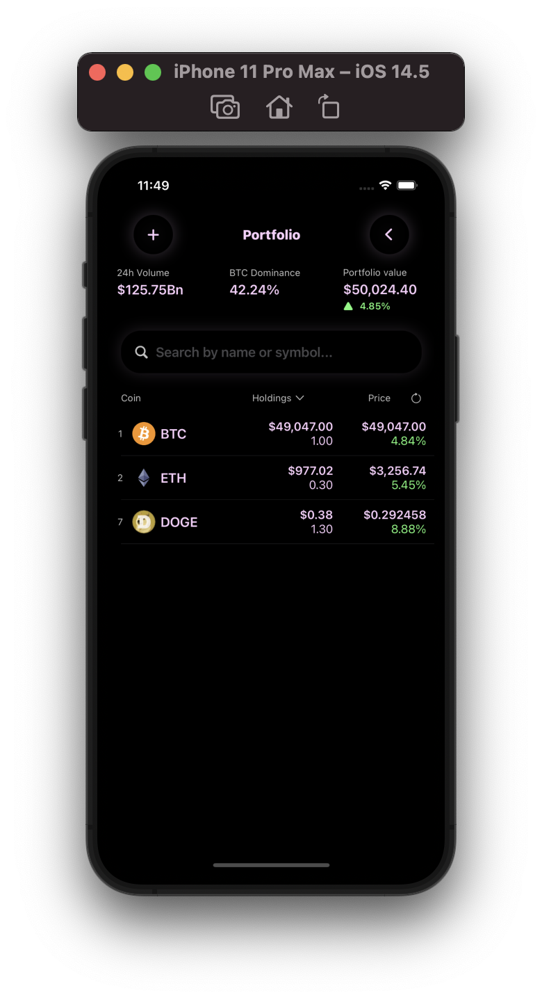
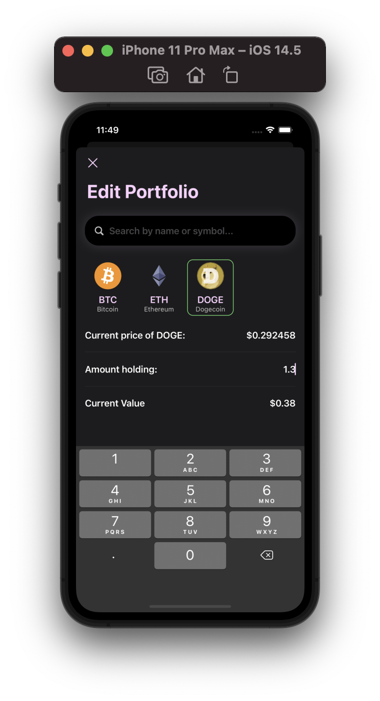
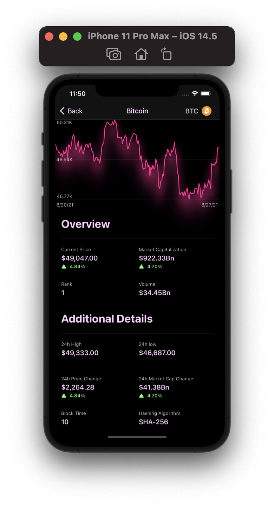

# CryptoApp

This app was made by following [@SwiftfulThinking](https://www.youtube.com/channel/UCp25X4LzOLaksp5qY0YMUzg) playlist [SwiftUI Crypto App](https://www.youtube.com/watch?v=TTYKL6CfbSs&list=PLwvDm4Vfkdphbc3bgy_LpLRQ9DDfFGcFu) on Youtube. It uses MVVM architecture, Combine, and CoreData.

The project benefits from multi-threading, publishers/subscribers, and data persistance.

## API

The cryptocurrency data that is used in this app comes from a free API from [CoinGecko](https://www.coingecko.com)! Prices may be slightly delayed.

## Screenshots

   
